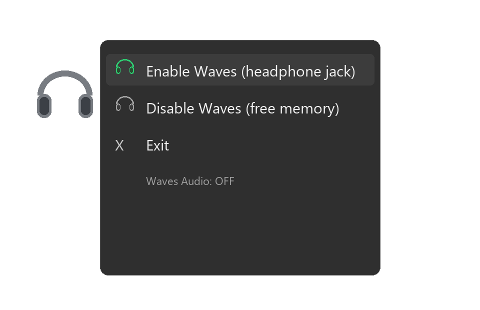

<p align="center">
  
</p>

<h1 align="center">WavesTray</h1>

<p align="center">
  A portable Windows tray utility for toggling the Waves MaxxAudio service when you need headphone-jack detection—without leaving its RAM usage running all day.
</p>

<p align="center">
  
  
  <a href="LICENSE"></a>
</p>

<p align="center">
  
</p>

> [!IMPORTANT]
> WavesTray **does not uninstall or modify the Waves audio driver package**. It only starts or stops the `WavesSysSvc` Windows service.

## Quick start

1. Clone or download this repository to a local folder, for example:

   ```text
   C:\Tools\WavesTray
   ```

2. Double-click `WavesTray.vbs`.

3. Right-click the headphones icon in the system tray:
   - **Enable Waves (headphone jack)** before plugging in 3.5 mm headphones.
   - **Disable Waves (free memory)** after you are done.

> [!NOTE]
> The app appears in the notification area. On Windows 11, click the `^` tray overflow button if it is not visible immediately.

## What it does

On many Dell systems using the Waves MaxxAudio stack, the `WavesSysSvc` service enables 3.5 mm headphone-jack detection and the Waves “What did you plug in?” prompt.

However, its companion process, typically `WavesSvc64.exe`, can reserve substantial memory while it is running.

WavesTray lets you switch between the two states from the tray:

| Tray icon | State | Result |
|---|---|---|
| Gray headphones | Waves OFF | Speakers continue to work; Waves service/process memory is released |
| Green headphones | Waves ON | Headphone-jack detection and the Waves popup are available |

When enabling Waves, wait a few seconds and then plug in—or re-plug—your headphones.

## Requirements

- Windows 10 or Windows 11
- A Dell or compatible machine with the Waves MaxxAudio driver stack
- Windows service: `WavesSysSvc`
- Usually associated process: `WavesSvc64.exe`
- Built-in PowerShell and .NET WinForms

No installer, third-party runtime, or permanent background process is required.

## Installation

### 1. Place the folder locally

Copy or clone the project somewhere in your user profile, such as:

```text
C:\Tools\WavesTray
```

Do not use a network drive: Startup applications and scheduled launches should use local paths.

### 2. Optional: prevent Waves from starting at boot

Set the service to **Manual** so it does not normally start during boot:

```powershell
# Run in an elevated PowerShell window
Set-Service WavesSysSvc -StartupType Manual
```

### 3. Create a launcher shortcut

1. Right-click `WavesTray.vbs`
2. Choose **Show more options** → **Send to** → **Desktop (create shortcut)**
3. Optionally assign `waves_tray.ico` as the shortcut icon

### 4. Start automatically at login

1. Press `Win + R`
2. Run:

   ```text
   shell:startup
   ```

3. Copy the same shortcut into that folder

## Usage

Right-click the tray icon and choose one of the following:

| Command | Effect |
|---|---|
| **Enable Waves (headphone jack)** | Starts `WavesSysSvc`. Windows requests elevation. After it starts, plug in or re-plug the headphones |
| **Disable Waves (free memory)** | Stops the service and terminates its process. Speakers continue to work normally |
| **Exit** | Closes WavesTray and leaves the Waves service in its current state |

Hover over the tray icon to view the detected service state and the live memory usage while Waves is enabled.

## Safety and limitations

> [!WARNING]
> Toggling the service requires administrator elevation, so each enable/disable operation triggers one UAC prompt.

- RAM consumption while Waves is enabled is controlled by the vendor’s service/process; WavesTray cannot reduce that allocation.
- Headphone-jack behavior can vary by Dell model, BIOS version, Windows version, and Waves driver package.
- If your machine uses a different service or process name, this tool may not be compatible without modification.
- Do **not** delete the Waves driver package. Removing it can break the machine’s audio stack.

<details>
<summary><strong>Advanced: Waves still starts at boot</strong></summary>

Some models also launch Waves from this registry entry:

```text
HKLM\SOFTWARE\Microsoft\Windows\CurrentVersion\Run\WavesSvc
```

If Waves starts at boot even after setting `WavesSysSvc` to Manual, remove that startup entry from an elevated PowerShell window:

```powershell
Remove-ItemProperty `
  'HKLM:\SOFTWARE\Microsoft\Windows\CurrentVersion\Run' `
  -Name 'WavesSvc'
```

> [!CAUTION]
> This changes a machine-wide startup setting. Export or record the current value first if you may want to restore it later.

</details>

<details>
<summary><strong>Why use a VBScript launcher?</strong></summary>

On Windows 11, PowerShell sessions may be hosted in Windows Terminal, which can briefly show a visible window even when PowerShell is launched with `-WindowStyle Hidden`.

`WavesTray.vbs` starts PowerShell with a hidden window so that WavesTray appears only as a tray icon.

</details>

## Troubleshooting

See [docs/troubleshooting.md](docs/troubleshooting.md) for common problems and fixes.

When reporting an issue, include:

- Windows version and build
- Laptop model
- Waves/MaxxAudio package version, if known
- Output of:

  ```powershell
  Get-Service WavesSysSvc
  ```

- Whether `WavesSvc64.exe` appears in Task Manager after enabling Waves

## Project files

| File | Purpose |
|---|---|
| `WavesTray.ps1` | Main tray application |
| `WavesTray.vbs` | Silent launcher; prevents a visible console window |
| `waves_tray.ico` | Gray/off tray and shortcut icon |
| `waves_tray_on.ico` | Green/on tray icon |
| `docs/troubleshooting.md` | Common problems and fixes |

## Contributing

Bug reports and tested compatibility reports are welcome. Please include your Windows version, device model, and Waves driver/package information.

## License

Released under the [MIT License](LICENSE).